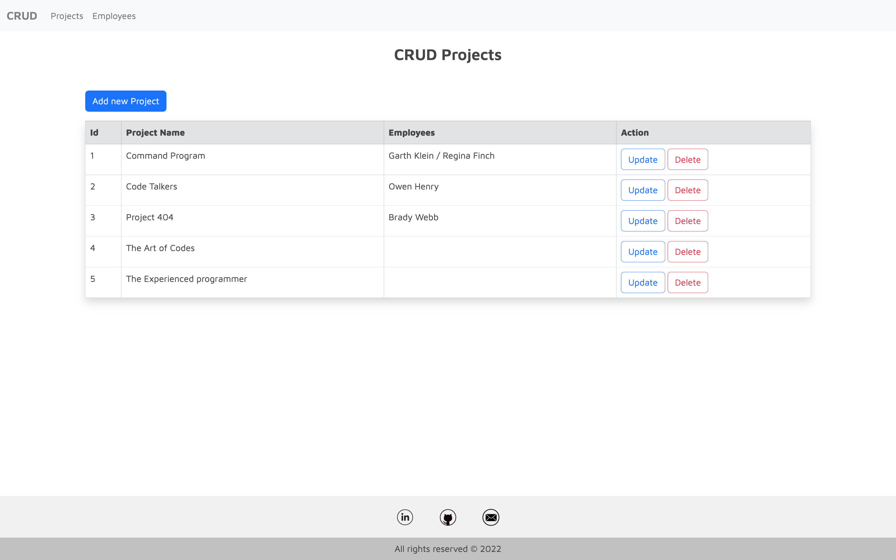
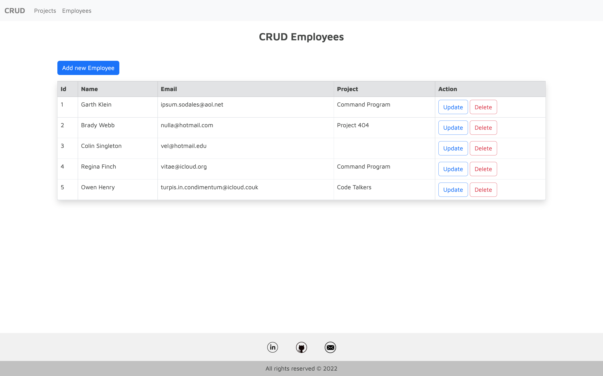

# CRUD app

*A simple application with basic CRUD functionality*.

## Application screenshots
##### CRUD Projects

##### CRUD Employees

## About

#### App is created with:
* HTML
* PHP
* MySQL Workbench
* CSS Framework Bootstrap
* CSS

#### App allows users to:
* Create a new project
* Create a new employee data
* Delete a project without deleting assigned employees
* Delete an employee without deleting assigned project
* Update project and  emoloyees data

## Getting Started
* Clone directory: https://github.com/BrigitaGrybaiteBartke/PHP_CRUD.git
* Run XAMPP and start Apache Server and Mysql database
* Open XAMPP htdocs folder - clone application code to this folder
* Create connection on MySQL Workbench:
    * hostname ***127.0.0.1***
    * port ***3306***
    * username ***root***
    * ***no password*** required

* Once connected to the database follow these steps:
    * select ***Server*** and choose ***Data Import***
    * choose the option ***Import from Self-Contained File***
    * select ***dump.sql*** file from cloned repository folder
    * click on ***Start Import***
* Home page: ***http://localhost/*** "ENTER created folder name here"

## Author
App is created by Brigita Grybaitė-Bartkė
[Github](https://github.com/BrigitaGrybaiteBartke)
[Linkedin](https://www.linkedin.com/in/brigita-grybait%C4%97-bartk%C4%97-487403112/)